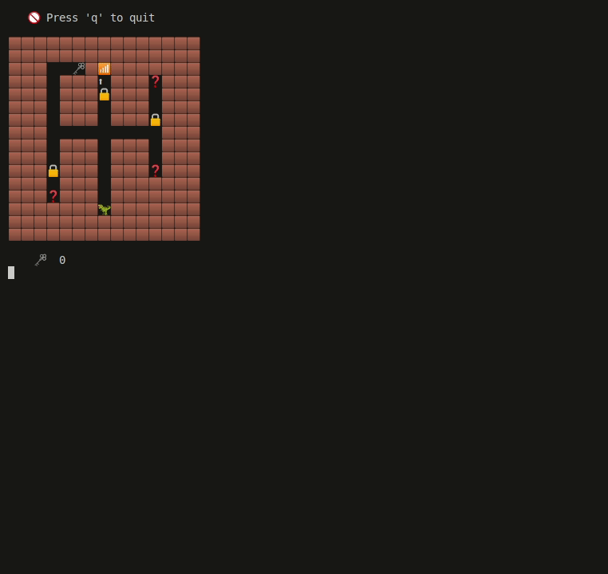

**Welcome to Dungeon Escape (Educational) 👋**

After having used my CLI Adventure Game to teach many beginner  
students as a software educator and guest lecturer, I decided to open-source  
the material in the hopes that it benefits others.

Feel free to contribute to this code-base or use it as you wish!

<br>
<figure>
    <p align="center">
        
        <br>
        <em>Figure 1: Example of dungeon escape</em>
    </p>
</figure>
<br>

You may notice that some code could be optimized, shortened or more structured.
Keep in mind that this is introductive (although more advanced) educational material.
Therefore the focus was readable and understandable code for beginners with a basic grasp
on programming concepts such as primitive data structures, functions, loops and variables.

As this might be of benefit to any starting developer, I have decided to open-source it.
Enjoy, and feel free to open an issue on my github (AjobK) or send an e-mail (ajobkustra.p@gmail.com)

## Installation and support

*This section is still to be written. You need Python...*

## License (MIT, open-source)

```                                                    
 ____  _____    _____ _____ _____ _____ _____ _____ 
|    \|   __|  |   __|   __|     |  _  |  _  |   __|
|  |  |  |  |  |   __|__   |   --|     |   __|   __|
|____/|_____|  |_____|_____|_____|__|__|__|  |_____|

Copyright (c) 2024 Ajob Kustra

Permission is hereby granted, free of charge, to any person obtaining a copy
of this software and associated documentation files (the "Software"), to deal
in the Software without restriction, including without limitation the rights
to use, copy, modify, merge, publish, distribute, sublicense, and/or sell
copies of the Software, and to permit persons to whom the Software is
furnished to do so, subject to the following conditions:

The above copyright notice and this permission notice shall be included in all
copies or substantial portions of the Software.

THE SOFTWARE IS PROVIDED "AS IS", WITHOUT WARRANTY OF ANY KIND, EXPRESS OR
IMPLIED, INCLUDING BUT NOT LIMITED TO THE WARRANTIES OF MERCHANTABILITY,
FITNESS FOR A PARTICULAR PURPOSE AND NONINFRINGEMENT. IN NO EVENT SHALL THE
AUTHORS OR COPYRIGHT HOLDERS BE LIABLE FOR ANY CLAIM, DAMAGES OR OTHER
LIABILITY, WHETHER IN AN ACTION OF CONTRACT, TORT OR OTHERWISE, ARISING FROM,
OUT OF OR IN CONNECTION WITH THE SOFTWARE OR THE USE OR OTHER DEALINGS IN THE
SOFTWARE.
```